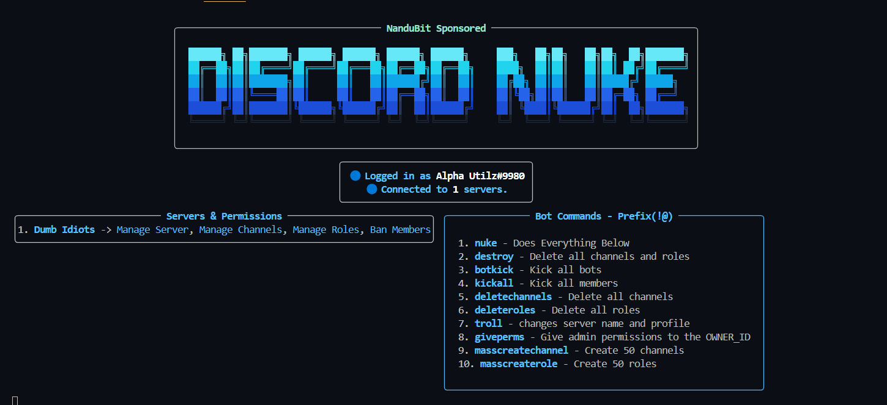

# Discord Nuke Bot



## Features

- Terminal dashboard with server and permissions info (Rich).
- Prefix commands (`!@command`) and slash command (`/setup`) to instant nuke unsuspecting victims.
- Commands for nuking, deleting channels/roles, kicking bots/members, trolling, and more.

## Setup

1. **Clone the repository** and navigate to the project folder.

2. **Install dependencies:**
   ```bash
   pip install -r requirements.txt
   ```

3. **Configure the bot:**
   - Edit `config.py` and fill in your bot token and your Discord user ID:
     ```python
     BOT_TOKEN = "<your-bot-token>"
     OWNER_ID = <your-user-id>
     ```

4. **(Optional) Place an image for trolling:**
   - Save the provided banner image as `banner.png` in the same directory.
   - For the troll command, place an `image.png` in the same directory.

5. **Run the bot:**
   ```bash
   python main.py
   ```

## Usage

### Prefix Commands (Owner Only)

Type these in any server where the bot is present:

- `!@nuke` - Run all destructive actions (nuke server).
- `!@deletechannel` - Delete all channels.
- `!@deleterole` - Delete all roles.
- `!@botkick` - Kick all bots.
- `!@kickall` - Kick all members (except you).
- `!@troll` - Change server name and icon.
- `!@giveperm` - Give admin role to OWNER_ID.
- `!@masscreatechannel` - Create 50 channels and send a message in each.
- `!@masscreaterole` - Create 50 roles.

### Slash Command

- `/setup`  
  - If the bot has admin permissions, it will nuke the server.
  - If not, it will send an innocent message saying need administator for using this command..

## Notes

- Only the OWNER_ID can use the commands.
- Make sure to enable the "Server Members Intent" in the Discord developer portal.
- Do **NOT** share your `config.py` or bot token.
- The bot is destructive. Use with caution and only in test servers.

## License

For educational purposes only.
